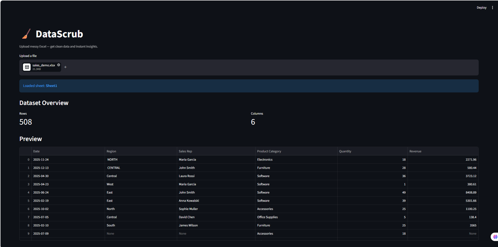
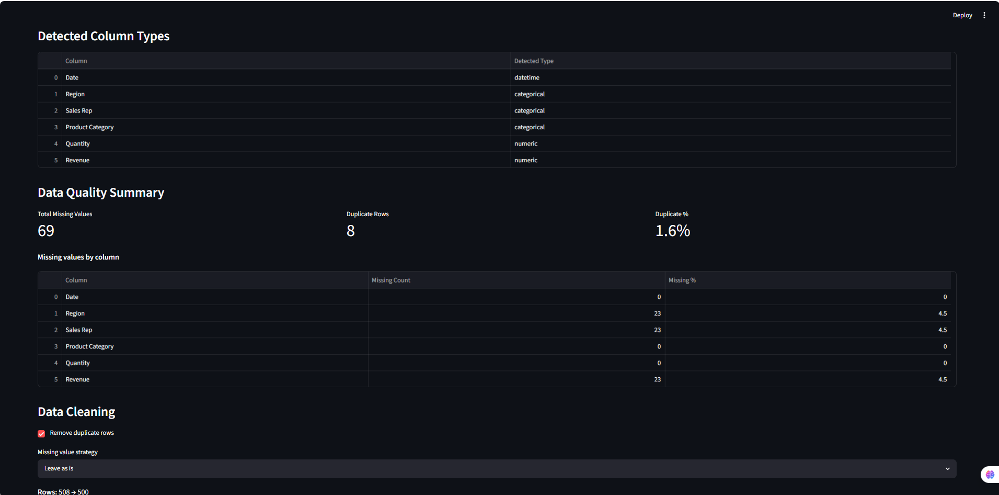
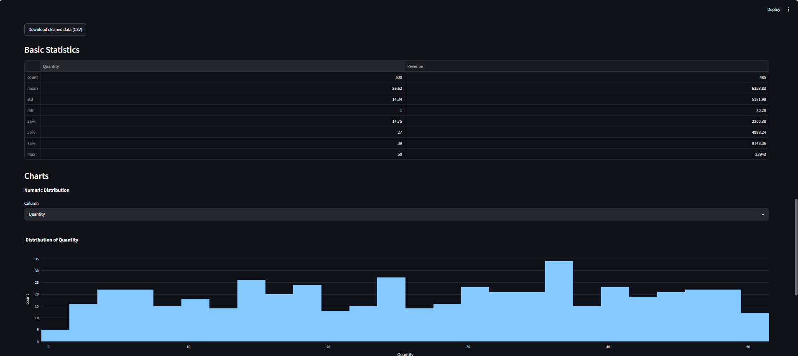
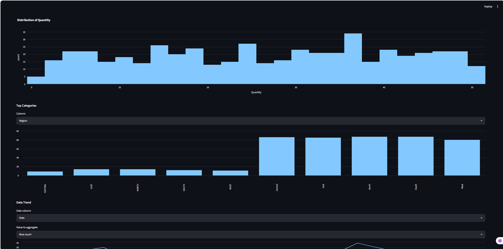

# DataScrub


Upload messy Excel — get clean data and instant insights.

**[Try the live demo](https://datascrub-vwaxjytmyc838t3fbntnqf.streamlit.app)**

## Overview

DataScrub is a single-page Streamlit app that turns a messy `.csv` or `.xlsx`
export into something usable in under a minute: a data quality summary,
a cleaned dataset, basic statistics, a few charts, and a downloadable Excel
report. It's built to look and behave like an internal business tool — the
kind of thing a small team would actually reach for before opening a
spreadsheet — rather than a tutorial demo.

## Features

- **Upload** `.csv` or `.xlsx` files, with automatic encoding fallback for
  non-UTF-8 CSVs (handles Cyrillic, Polish, and other Latin/Cyrillic text).
- **Preview & column detection** — dataset shape, column list, data preview,
  and per-column type detection (numeric / categorical / datetime /
  mixed-unknown).
- **Data quality summary** — missing values per column and in total,
  duplicate row count and percentage, and plain-language warnings for
  problematic columns (high missing %, mixed types, constant values).
- **Cleaning workflow** — optionally remove duplicate rows, choose a
  missing-value strategy (leave as is, drop rows, or fill numeric columns
  with the median / text columns with `"Unknown"`), and optionally normalize
  text columns (trims whitespace and unifies casing to title case, so
  `"CENTRAL"`, `"central "`, and `"Central"` merge into one category), with
  a transparent before/after summary. Download the cleaned data as CSV.
- **Basic statistics** — descriptive statistics (count, mean, std, quartiles)
  for numeric columns.
- **Charts** — numeric distribution histogram, top categories bar chart, and
  a monthly date trend line, each with a column picker.
- **Excel report export** — a single `.xlsx` with Summary, Data Quality,
  Cleaned Data, and (when applicable) Statistics sheets.

Large files (50,000+ rows) are automatically sampled for chart rendering;
quality checks, cleaning, and export always run on the full dataset.

## Demo Data

Two reproducible demo datasets are included in `data/demo/`:

- `sales_demo.xlsx` — ~500 rows of a year of company sales (dates, regions,
  sales reps, product categories, revenue, quantity), with realistic
  inconsistencies: inconsistent region casing/whitespace, missing values,
  and duplicate rows.
- `product_catalog_dirty.xlsx` — ~200 rows of a product catalog (product ID,
  name, category, price, stock, supplier) with intentional missing values
  and duplicate rows.

Regenerate them at any time with:

```bash
python scripts/generate_demo_data.py
```

## Tech Stack

- Python, Streamlit
- Pandas, OpenPyXL
- Plotly Express (used only for the distribution histogram; everything else
  uses Streamlit's native charts)
- Pytest

## Installation

```bash
python -m venv .venv
.venv\Scripts\activate      # Windows
# source .venv/bin/activate # macOS/Linux

pip install -r requirements.txt
```

## Usage

```bash
streamlit run app.py
```

Then open the local URL Streamlit prints (typically `http://localhost:8501`),
upload a `.csv` or `.xlsx` file — or one of the demo files in `data/demo/` —
and work through the quality summary, cleaning, statistics, charts, and
report export sections.

## Screenshots


*Upload a file and preview its contents and detected column types.*


*Data quality summary — missing values, duplicates, and warnings.*


*Cleaning controls with a summary of rows removed and cells filled.*


*Basic statistics and charts for numeric, categorical, and date columns.*

## Project Structure

```
datascrub/
├── app.py                     # Streamlit UI layer only
├── CLAUDE.md                  # persistent project rules
├── requirements.txt
├── data/demo/                 # reproducible demo datasets
├── scripts/
│   └── generate_demo_data.py
├── src/
│   ├── data_loader.py         # CSV/XLSX loading, encoding fallback, sampling
│   ├── data_profiler.py       # type detection, quality summaries, stats
│   ├── cleaner.py             # dedupe + missing-value strategies
│   ├── charts.py              # chart rendering (distribution/categories/trend)
│   └── report_exporter.py     # multi-sheet Excel report builder
├── tests/
│   ├── test_data_profiler.py
│   ├── test_cleaner.py
│   ├── test_data_loader.py
│   └── fixtures/               # real messy CSVs used in loader regression tests
└── assets/screenshots/
```

## Testing

Tests cover the data-processing logic only (`src/data_profiler.py`,
`src/cleaner.py`, `src/data_loader.py`) using plain in-memory DataFrames —
no Streamlit UI tests. `test_data_loader.py` includes delimiter and encoding
detection, with regression fixtures for real semicolon-delimited cp1250
(Polish) and cp1251 (Cyrillic) CSVs, plus multi-sheet Excel selection.

```bash
pytest
```

## Roadmap

Possible future additions, out of scope for this MVP+:

- Advanced filtering (per-column filters before cleaning/charting)
- Custom, user-defined cleaning rules
- PDF report export alongside the Excel report
- One-click deployment to Streamlit Community Cloud

## Notes

Built as a focused MVP+: no authentication, no database, no multi-page
structure, no ML — just a reliable, readable tool for turning messy
spreadsheets into clean data and quick insights.
